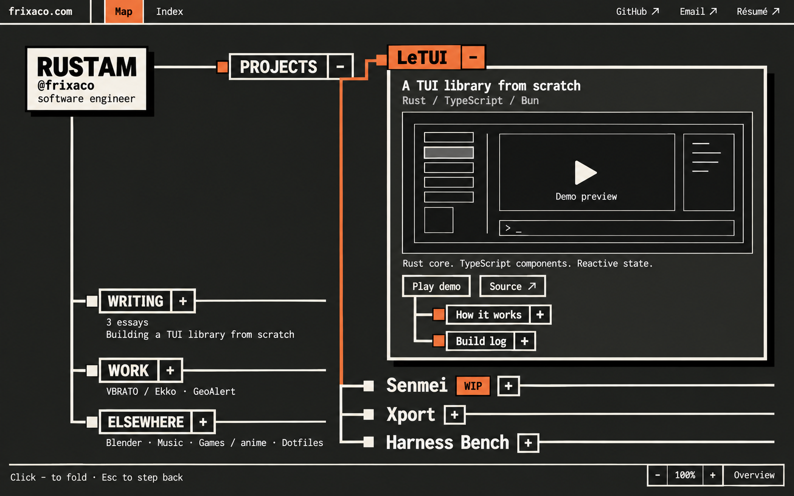

# Approved homepage design checkpoint

Approved by Rustam on September 30, 2026: “very good checkpoint and idea implementation.”

Status: approved visual direction and interaction concept; saved as mockups, with website implementation still pending.

## Primary reference

- **Visual baseline:** [v4 dark expanded view](homepage-canvas-v4-dark.png).
- **Generation prompt:** [v4 prompt](homepage-canvas-v4-dark-prompt.txt), created with built-in imagegen.
- **Interaction references:** [v3 overview](homepage-canvas-v3-overview.png) and [v3 expanded view](homepage-canvas-v3-expanded.png). Apply the approved v4 styling to both states.

## Design direction

A personal portfolio organized as an unfolding tree on a pannable, zoomable canvas. Rustam is the root; Projects, Writing, Work, and Elsewhere are branches. Keep actual content visible and the composition compact.

Dark, serious neobrutalism: charcoal surfaces, bone-white text, heavy square borders, crisp offset shadows, bold tightly set headings, and monospace supporting copy. Burnt orange marks selection and the active path. The root is a contrasting bone-white identity plate.

Avoid decorative scenery, doodles, texture, gradients, glow, rounded cards, generic landing-page sections, oversized hero copy, and large empty spaces. Project previews provide the visual substance.

## Intended interaction

- Clicking a node unfolds its content within its own branch. Nearby nodes make room; the active path stays visible.
- Keep one sibling expanded at a time. Opening another project folds the previous one.
- An expanded project contains its preview, concise description, actions, and deeper branches such as “How it works” and “Build log.”
- Preserve clear parent/sibling relationships as the tree expands. Move the camera only enough to keep opened content in view.
- Plus/minus controls indicate unfolding and folding. External-link arrows indicate actual external destinations.
- Escape steps back; Overview restores the map. Pan and zoom are optional; ordinary clicks and keyboard controls should support exploration.
- Keep Map / Index navigation and direct GitHub, Email, and Résumé links available.

## Implementation handoff

- Use the existing Markdown content for project details, writing, experience, and personal interests.
- Preserve existing routes and the repository's small Rust, Markdown-first architecture.
- The demo area is a placeholder for real project previews to be supplied later.
- Treat the mockup as the visual reference and these notes as the interaction specification; static images do not demonstrate the transitions.
- Keep keyboard access, readable contrast, reduced-motion support, and a usable narrow-screen index in the implementation.
- Start future design or implementation work from this checkpoint. Earlier images remain available as exploration history.
